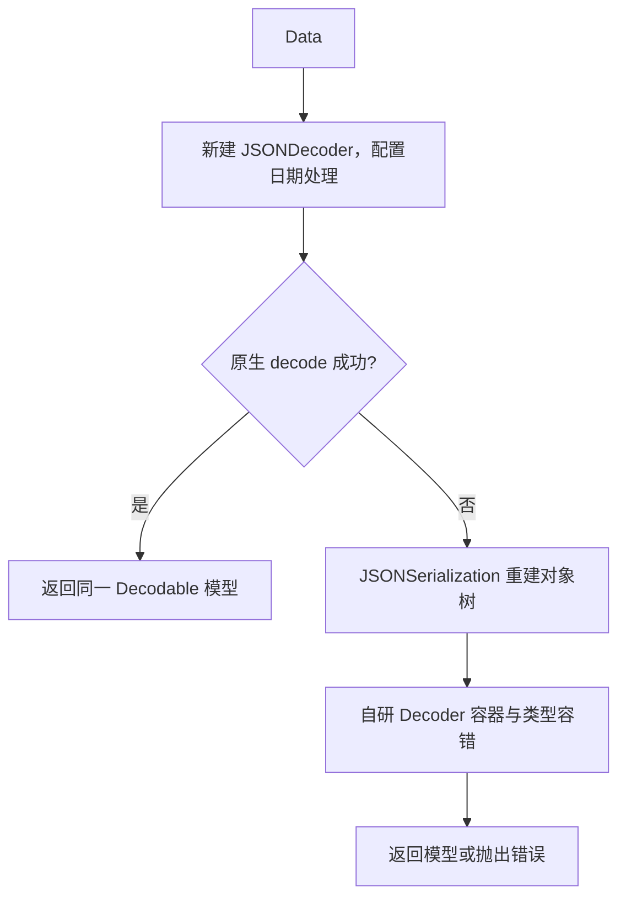

# YYModel2 2.1.9 交付说明与性能验证

交付对象：需要保留原版 Objective-C 模型能力，同时逐步采用 Swift struct/Codable 的项目。验证日期：2026-10-04。

这份交付的目标是回答三个实际决策：2.1.9 能否在已验证场景中替换 ibireme 原版；Swift 新代码选择原生 JSONDecoder、YYJSONDecoder 还是复用 OC 模型；两套 API 共存是否引入额外代价。所有新验证都在组件仓库完成，使用公开天气快照和明确标记的构造数据，未使用或修改正式业务 App。

**已确认的结论**：相同 OC 模型、相同输入的 10 组工作负载，在两种运行环境的相邻交替复测中，2.1.9 相对原版中位耗时变化为 −8.39%～+8.47%。本次没有复现持续超过预设 10% 观察线的退化，支持这些场景保持原版性能档位；不能据此宣称所有场景等效或全面更快。完整主测中的较慢结果也保留在文档和回执中。

Swift 的原生优先方案仍在：符合模型的 Data 先由 JSONDecoder 解析，失败后才进入自研容错路径。YYJSONDecoder 的主要收益是减少容错解码样板代码，而不是承诺比原生 JSONDecoder 更快。混合调用的受控复测没有呈现稳定的整体惩罚；已解析 Foundation 字典的直接 OC 映射，普通载荷约 10～11 µs/次，值得保留。

**已确认的使用限制**：Swift 默认 JSONEncoder 与 YYJSONDecoder 的 Date 时间原点不同，往返必须明确编码策略；OC 负毫秒时间戳仍有错误/拒绝行为。本交付披露这些事实，没有把“测试通过”写成“框架没有任何问题”。

## 1. 源码身份与证据范围

| 对象 | 固定身份 |
| --- | --- |
| 本次库版本 | `2.1.9`，`00329f245752ed0e264e8c90bc14a6bd4e4e46e5` |
| OC 性能基准 | [ibireme/YYModel](https://github.com/ibireme/YYModel)，`c7df27538c043e5f54f5b6605958544bb529892f` |
| 核心修复来源 | `2e8dd015776444c5c14ff6f0620b8024370fa89a`；与 2.1.9 的库核心文件逐字节一致 |
| 当前交付改动 | 文档和公开 API 验证包；不修改库实现、不移动 2.1.9 标签 |

**已确认事实**来自固定源码、实际编译、完整输出与独立 oracle 判定。**合理推测**仅包括负载、桥接和测量环境对耗时差异的解释；没有用这些解释证明优化归因。**未验证假设**包括实体 iPhone/iOS 27 性能、其他 DTO 的等效性、内存峰值、并行吞吐、长期稳定性及任意业务输入的完全兼容。

不能把模拟器名中的“iPhone 13 mini”写成 A15 真机测试。Demo 输出中的“iOS 27 fix verified”也只是原有程序文字，不是本次运行的 OS 版本证据。

## 2. 三条调用路径与混合使用

| 路径 | 模型与入口 | 本次是否实测 | 适用需求 |
| --- | --- | --- | --- |
| OC → OC API | NSObject，`yy_modelWithJSON:` / `yy_modelWithDictionary:` | 是；原版和 2.1.9 使用完全相同的 OC 类 | 保留已有 OC 模型、Mapper、容器泛型、多态与导出 |
| Swift → OC API | Swift 调用导入的 OC NSObject 模型，`yy_model(withJSON:)` / `yy_model(with:)` | 是；与 OC 调用方共享同一模型实现 | Swift 页面复用现有 OC 模型与契约 |
| Swift → Swift API | 普通 Codable struct，`YYJSONDecoder.decode`，对照 `JSONDecoder.decode` | 是；两者使用完全相同的 Codable DTO | 新的 Swift 强类型嵌套数据模型和容错 |
| 同进程混合 | OC 引擎与 Swift decoder 同时链接，处理两份独立响应 | 是；检验两种执行顺序与结果 | 按模块选择 API，逐步迁移 |

原版没有 YYJSONDecoder，不能构造“原版 Swift API”对照。验证中的 original-mixed 程序只用于原版 OC 调用对照，其 Swift decoder 来自当前版本，不计作原版功能。

Swift→OC 是有价值的路径：可以直接复用已有模型，不需要把所有业务模型改成 struct。struct→编码 JSON→再次调用 OC 解析没有独立业务必要性，本次不将它列为性能目标。Swift 自己编写的 NSObject 子类具有额外的属性暴露限制；本次耗时数据测的是导入的 OC 类，不外推为所有 Swift NSObject DTO 的耗时。

## 3. Objective-C 契约、恢复项与新增能力

| 能力 | 2.1.9 的实现与范围 | 与原版的关系 |
| --- | --- | --- |
| 根对象多态 | 根入口执行 `modelCustomClassForDictionary:`，按返回类创建对象 | 保留原版契约；不是 fork 独有能力 |
| 转换拒绝 | 根 `modelCustomWillTransformFromDictionary:` 返回 nil 或 From hook 返回 NO 时解析失败；创建入口返回 nil、setter 返回 NO | 恢复/保留原版行为 |
| KeyPath / 多 key | 安全检查中间节点；输入多 key 备选，导出恢复嵌套字典 | 原版已有；用于验证重构没有丢失 |
| 导出 hook | 自动生成属性字典后执行 To hook，并使用其 BOOL 结果 | 原版契约 |
| Foundation 容器 | 基础类按 Foundation 类型处理，自定义类才按模型转换；泛型类筛选与容器往返可验收 | 防止重构路径把基础类型误当模型 |
| 继承 Mapper / 泛型配置 | 从父类到子类合并；子类同名项覆盖，父类独有项保留 | 明确增强，行为不等同原版单一最具体 hook 调用 |
| 黑/白名单 | 使用当前类有效 hook；子类重写不自动与父类合并；空白名单只允许零字段 | 原版语义；不能把 Mapper 合并扩展为名单也合并 |
| 数值保真 | UInt64/NSDecimalNumber 转换避免不必要的 Double 中间值，精确处理已验证边界 | 数值正确性增强；不意味着所有 OC 宽松转换变成严格拒绝 |
| 现代 ABI / 归档 | 匹配参数类型的 objc_msgSend 函数指针、类型尺寸处理、受控安全归档 | 兼容性与正确性价值；没有独立证据证明每项都会加速 |
| 元数据缓存 | 热路径复用类/属性元数据，锁保护缓存读写 | 缓存原版已具备，不能作为 fork 独创优化宣传 |
| 可选严格嵌套转换 | 根类 `+modelRequiresSuccessfulNestedTransforms` 返回 YES，嵌套字典转换失败向根传播 | 新增能力，默认关闭，保留原版默认嵌套行为 |

缓存命中时不重复遍历继承链；并发首次未命中时，锁外可能构造多个候选元数据，不能写成“一个类在进程生命周期中绝对只构造一次”。OC 属性赋值调用 setter，不是直接写 ivar 内存。替换锁或修正函数指针 ABI 不足以单独证明某个百分比的加速。

原版会忽略部分嵌套模型 From hook 的失败，2.1.9 默认保留此行为；根对象失败仍然有效。需要完整嵌套校验时主动启用严格策略。严格策略覆盖本次解析中模型属性、数组、字典和集合里的字典转换；已经实例化的模型被信任。更新已有对象时可能先修改部分属性再失败，不提供事务回滚，也不把任意自定义 setter 重写当成协议校验。

安全归档能力不代表任意自定义对象自动支持 NSSecureCoding；需要模型及其归档内容配合相应协议和允许类。业务输入的最终合法性仍应由模型 hook 或业务规则判断。

## 4. Swift 能力与原生 Codable 对照

Codable 是 Encodable/Decodable 协议组合，实际性能对照对象是 JSONDecoder；Swift 导出使用 JSONEncoder。原生 Codable 本身支持 CodingKeys 和手写嵌套解码，不能把“YYJSONDecoder 默认没有提供”误写成“原生 Codable 无法做到”。[Apple：编码与解码自定义类型](https://developer.apple.com/documentation/foundation/encoding-and-decoding-custom-types)

| 需求 | 原生 JSONDecoder + 同一普通 DTO | YYJSONDecoder 2.1.9 |
| --- | --- | --- |
| 合规 JSON、嵌套 struct/数组 | 自动合成支持 | 原生优先，同一 DTO 可以直接使用 |
| CodingKeys 改名、忽略额外字段 | 已支持 | 同样支持；不算新增优势 |
| 数字字符串、数字/布尔与字符串转换 | 默认严格；可手写 init(from:) | 容错路径集中完成已支持的类型转换 |
| 缺失/null 非 Optional 字段 | 默认报错 | 支持的基本类型置零/空值，缺失容器尝试空容器；复杂自定义类型仍可能拒绝 |
| Optional 数组元素 null | 正常 Optional 支持 | 保留 nil 元素及顺序，容错路径已验证 |
| 大整数与小数字符串转整数 | 原生数字及模型自定义逻辑 | 精确数字语法、向零截断和目标范围检查；已测大数与十六进制边界 |
| 非有限值/缩窄溢出 | 取决于输入 API、类型及策略 | Double/Float/CGFloat/Decimal/Date 的自研转换具备有限性检查 |
| 日期 | 可显式选择多种策略 | 内置 Unix 秒/毫秒启发式、数值字符串、ISO8601 与常见格式；配置自由度较少 |
| 多 key 备选、点号 KeyPath、多态 | 可手写 Decodable | 没有额外 OC Mapper 自动协议；仍需手写或嵌套模型 |
| 解码器配置 | date/key/data/float 策略、userInfo 等 | 公开接口只有 init 与 Data/Any decode，未暴露完整原生策略配置 |
| 导出 | JSONEncoder | 仍为原生 JSONEncoder，没有 YYJSONEncoder |

YYJSONDecoder 的直接收益是普通 struct 不必为重复的脏数据类型转换到处手写解码逻辑。原生方案也能通过定制 Decodable 完成这些工作；如果字段契约稳定且需要严格缺失检查，原生 JSONDecoder 更直接。需要严格“必填 ID”时，不能把容错成功或零值当成业务有效；应在解码后验证领域规则，或在自定义 init(from:) 中校验。

Optional 仅处理缺失/null，不保证所有非法 URL 或非法 raw-value enum 自动变成 nil。无法转换的值仍可能抛出 DecodingError。框架是同步 API，YYJSONDecoder 声明 Sendable 不会让所有结果模型自动 Sendable，也不会自动调度后台任务或保证可变模型线程安全。

### 4.1 原生优先方案仍在

当前源码 [YYJSONDecoder.swift](../YYModelSwift/YYJSONDecoder.swift) 的 Data 入口执行顺序如下：



准确说法是“原生优先，自研容错兜底”。Any 入口若对象能序列化，会先重新编码为 Data 再试原生；失败或对象不适合这条路径，才进入自研容器。每次调用会新建内部 JSONDecoder，本次将其成本算入，没有偷偷复用。

失败的原生尝试可能已经执行部分模型 init(from:)，回退后会再次执行自定义初始化。不能保证“脏数据只解码一次”；自定义解码初始化应避免不可重复的外部副作用。

原生 JSONDecoder 公开提供日期等策略，因此“原生解析失败”只代表本次普通 DTO/默认对照设置，不能推导为所有配置的原生实现都不支持该数据。[Apple：JSONDecoder](https://developer.apple.com/documentation/foundation/jsondecoder)

## 5. 测量环境、数据与统计口径

| 项目 | 本次记录 |
| --- | --- |
| CPU / 架构 | Apple M1 Max / arm64 |
| macOS | 26.7 |
| Xcode | 26.6，17F113 |
| Swift | 6.3.3，swift-driver 1.148.6 |
| iOS 环境 | iOS 26.5 arm64 Simulator，运行在同一 M1 Max 上 |
| 编译 | OC -O2 + ARC，Swift -O；公开 API 验证程序 simulator target 为 iOS 17 |
| 主测 | 每路径预热 5 次；普通载荷 100 次/批，大载荷 8 次/批；正序/反序各 7 批，共 14 个批平均样本 |
| 相邻复测 | 原版/当前等配对按 A→B→B→A；普通 500 次/批，大载荷 32 次/批；每侧 14 样本 |
| 排除计时 | 网络、文件读取、object 阶段首次 JSON 解析、encode 阶段初始模型构建、正确性 oracle |
| 保留计时 | API 内部 JSON 解析、Any 重编码、调用处桥接、模型构建、结果字段读取、临时对象释放 |

天气数据源：[Open-Meteo](https://open-meteo.com/)，CC BY 4.0，归属和实际请求保存在 [weather-source.json](../Validation/fixtures/weather-source.json)。原始响应 [weather-api.json](../Validation/fixtures/weather-api.json) 于 2026-10-03T16:24:49.551679Z 获取，SHA-256 为 `92f13b21a4dfb74647d8d55548bb5ecf2730169a7622f95e51ddd81368ceb21c`。全部性能测试使用离线固定字节，网络延迟不计入。

request/payload 包装层、warnings 和脏数据变体是组件测试构造；不宣称它们是天气 API 原始响应。large 是重复城市条目的合成扩容，不是一份真实 96 城市在线请求。


| 载荷 | 字节 | 城市 | 小时行 | 日行 | 变化 | 原生普通 DTO |
| --- | --- | --- | --- | --- | --- | --- |
| clean | 15785 | 3 | 288 | 12 | 原始类型 + 测试包装 | 成功 |
| dirty | 15792 | 3 | 288 | 12 | 若干数字改字符串、ok 改 yes | 预期拒绝，不计成功吞吐 |
| nullable | 15785 | 3 | 288 | 12 | 一个温度元素为 null | 成功 |
| sparse | 11758 | 3 | 192 | 12 | 首城市缺 latitude/hourly | 预期拒绝，不计成功吞吐 |
| large | 501555 | 96 | 9216 | 384 | 32 倍城市条目 | 成功 |


**模型表示差异**：OC 天气模型的小时/日数组保留 Foundation 的 NSNumber/NSString/NSNull；Swift DTO 使用 `[Double?]`、`[Int?]` 等，解析时逐元素建立强类型值。独立 oracle 在计时外把两者投影到相同业务值。因此 OC 与 Swift 的直接倍数包含表示差异，不能用来证明哪个底层引擎同等工作量更快。原版与 fork OC 的比较、Native 与 YY 的 Swift 比较、OC 调用方与 Swift 调用方的比较各自共享完全相同的模型。

所有计时均在正确性验收后执行，性能任务顺序运行，没有与其他基准并行。未锁定 CPU 频率、温度和调度；微小百分比不能被包装成稳定优化。

## 6. 对照 ibireme：OC 性能是否保持

表中单位均为 **ms/操作，中位数**。差异 = 当前/原版 − 1，负数表示当前耗时较低。data 包含 JSON 字节解析，object 只映射已解析字典，encode 从已经建好的模型导出 JSON Data。

### 6.1 相邻交替复测：完整 10 组


| 阶段:载荷 | macOS 原版 | macOS 2.1.9 | 差异 | iOS 模拟器原版 | iOS 模拟器 2.1.9 | 差异 |
| --- | --- | --- | --- | --- | --- | --- |
| data:clean | 0.307233 | 0.293582 | -4.44% | 0.357224 | 0.334630 | -6.32% |
| data:dirty | 0.289233 | 0.264961 | -8.39% | 0.319962 | 0.334817 | +4.64% |
| data:nullable | 0.302684 | 0.282932 | -6.53% | 0.338848 | 0.356166 | +5.11% |
| data:sparse | 0.203396 | 0.205362 | +0.97% | 0.232148 | 0.242250 | +4.35% |
| data:large | 9.215204 | 8.743914 | -5.11% | 10.499786 | 11.103910 | +5.75% |
| object:clean | 0.010345 | 0.010295 | -0.49% | 0.010899 | 0.010546 | -3.24% |
| object:dirty | 0.011075 | 0.011580 | +4.56% | 0.011566 | 0.012546 | +8.47% |
| object:large | 0.335260 | 0.316173 | -5.69% | 0.335517 | 0.360347 | +7.40% |
| encode:clean | 0.654459 | 0.688018 | +5.13% | 0.800901 | 0.762463 | -4.80% |
| encode:large | 21.424473 | 21.825981 | +1.87% | 23.479951 | 23.995229 | +2.19% |


在这 20 个平台/负载组合中没有超过 +10% 观察线的持续退化。这是限定环境与模型的实测判断，不是统计学等效检验，不是任意业务 SLA。object:dirty 在模拟器仍慢 +8.47%，encode:clean 在 macOS 慢 +5.13%；这些不是“全面更强”的证据。

### 6.2 主测结果也全部保留

长矩阵主测中 macOS 的多组路径曾慢约 10%～13%，模拟器 object:dirty 也曾慢 +10.14%，因此按事先约定追加了相邻、较长批次复测。所有 10 组 OC 路径都复测，未只选择表现好的项目。复测未持续重现越线，不删除第一次结果；不将两次不同口径样本拼成一个更漂亮的中位数。


| 阶段:载荷 | macOS 原版 | macOS 2.1.9 | 差异 | iOS 模拟器原版 | iOS 模拟器 2.1.9 | 差异 |
| --- | --- | --- | --- | --- | --- | --- |
| data:clean | 0.266003 | 0.257716 | -3.12% | 0.305095 | 0.298042 | -2.31% |
| data:dirty | 0.255445 | 0.281325 | +10.13% | 0.327356 | 0.315226 | -3.71% |
| data:nullable | 0.259462 | 0.289439 | +11.55% | 0.316966 | 0.301954 | -4.74% |
| data:sparse | 0.184478 | 0.208394 | +12.96% | 0.221087 | 0.216141 | -2.24% |
| data:large | 8.257893 | 9.265581 | +12.20% | 9.895732 | 9.534312 | -3.65% |
| object:clean | 0.010831 | 0.010476 | -3.27% | 0.010956 | 0.010251 | -6.43% |
| object:dirty | 0.010437 | 0.010906 | +4.50% | 0.010771 | 0.011863 | +10.14% |
| object:large | 0.301732 | 0.327026 | +8.38% | 0.317388 | 0.318802 | +0.45% |
| encode:clean | 0.658712 | 0.661472 | +0.42% | 0.693006 | 0.733023 | +5.77% |
| encode:large | 19.882714 | 22.206807 | +11.69% | 24.280130 | 25.163323 | +3.64% |


**回答“优化后哪里更强”**：实测支持部分负载略快和总体保持性能档位；更明确的提升来自现代 ABI 兼容、数值保真、继承配置、可选嵌套严格校验及新增 Swift struct 接口。缓存、KeyPath、JSON 往返和字典/属性遍历策略原版已有，不能把恢复这些能力宣传成新算法加速。没有足够证据将本次百分比差异归因到某个单独修改。

## 7. 三种语言/API 路径的详细数据

### 7.1 Data → Model：主测完整五类输入

这些是长矩阵主测数据，不同于上面的相邻配对复测。单位 ms/次。拒绝表示原生对照没成功创建业务模型，没有把失败耗时当成吞吐优势。


#### macOS

| 载荷 | OC 原版 | OC 2.1.9 | Swift → OC 2.1.9 | Swift 原生 JSONDecoder | Swift YYJSONDecoder |
| --- | --- | --- | --- | --- | --- |
| clean | 0.266003 | 0.257716 | 0.279094 | 0.882299 | 0.917215 |
| dirty | 0.255445 | 0.281325 | 0.275811 | 拒绝 | 5.019542 |
| nullable | 0.259462 | 0.289439 | 0.293370 | 0.940853 | 0.873866 |
| sparse | 0.184478 | 0.208394 | 0.192414 | 拒绝 | 3.523915 |
| large | 8.257893 | 9.265581 | 8.646794 | 28.403542 | 26.586383 |

#### iOS 26.5 Simulator

| 载荷 | OC 原版 | OC 2.1.9 | Swift → OC 2.1.9 | Swift 原生 JSONDecoder | Swift YYJSONDecoder |
| --- | --- | --- | --- | --- | --- |
| clean | 0.305095 | 0.298042 | 0.300604 | 0.840059 | 0.854160 |
| dirty | 0.327356 | 0.315226 | 0.300908 | 拒绝 | 4.221353 |
| nullable | 0.316966 | 0.301954 | 0.318327 | 0.849217 | 0.791586 |
| sparse | 0.221087 | 0.216141 | 0.239673 | 拒绝 | 2.863290 |
| large | 9.895732 | 9.534312 | 9.548326 | 25.791872 | 25.642279 |


本次 Swift dirty 回退比同引擎 clean 慢约 5.47 倍（macOS）/4.94 倍（模拟器）。成本包含失败的原生尝试、对象树重建和容错逐元素转换；并不是 Objective-C 异常处理性能。数据中的日期保留 String，不能从天气耗时证明 DateFormatter 的性能。

### 7.2 已解析对象 → Model

单位 ms/次，包含 API 调用内发生的桥接/重新编码，不含计时前首次 JSONSerialization。Native object 是显式重新编码为 Data 后调用 JSONDecoder；YY Any 的重新编码在库内部，两者都计入。


| 环境 | 载荷 | OC NSDictionary | Swift Dictionary → OC | Swift NSDictionary → OC | Native 重编码 + decode | YY Any |
| --- | --- | --- | --- | --- | --- | --- |
| macOS | clean | 0.010476 | 0.013430 | 0.010326 | 1.303225 | 1.498950 |
| macOS | dirty | 0.010906 | 0.013945 | 0.011132 | 拒绝 | 5.089200 |
| macOS | large | 0.327026 | 0.315708 | 0.326094 | 40.279570 | 47.673208 |
| iOS Simulator | clean | 0.010251 | 0.014306 | 0.010694 | 1.339494 | 1.625115 |
| iOS Simulator | dirty | 0.011863 | 0.014292 | 0.012393 | 拒绝 | 4.639304 |
| iOS Simulator | large | 0.318802 | 0.330281 | 0.321841 | 41.798500 | 51.506279 |


Swift Dictionary → OC 使用 `[String:Any]` 调用 `yy_model(with:)`；Foundation 路径使用已解析的 NSDictionary 调用 `yy_model(withJSON:)`，OC 入口识别字典后直接映射。后者不经过 struct 或 JSON 重解析，是值得保留的实际使用策略。两组绝对耗时来自独立主测/补充测量，只用于展示量级，不能从比值精确扣出单次桥接耗时。

如果 Swift struct 路径已经拿到网络 Data，应优先直接 decode Data。先 JSONSerialization 再调用 YY Any，会增加重编码成本，clean 本次约 1.50/1.63 ms，而直接 Data 约 0.92/0.85 ms。

### 7.3 Model → JSON Data

单位 ms/次。OC 调用 `yy_modelToJSONData`；Swift 两列都调用相同的原生 JSONEncoder，只是初始模型来自不同 decoder。表格不表示 YY 有独立 Swift 编码器或编码算法优化。


| 环境 | 载荷 | 原版 OC 导出 | 2.1.9 OC 导出 | Swift → OC 导出 | Native 模型 + JSONEncoder | YY 模型 + JSONEncoder |
| --- | --- | --- | --- | --- | --- | --- |
| macOS | clean | 0.658712 | 0.661472 | 0.605488 | 1.417803 | 1.399120 |
| macOS | large | 19.882714 | 22.206807 | 22.240794 | 44.624693 | 43.839167 |
| iOS Simulator | clean | 0.693006 | 0.733023 | 0.734638 | 1.275673 | 1.373787 |
| iOS Simulator | large | 24.280130 | 25.163323 | 23.772430 | 40.566273 | 39.119810 |


## 8. 控制调用方、原生与混合链接差异

以下四组均测 clean Data（15,785 字节）。为了区分 API/模型差异与编译共存，同一个配对内使用相同输入并相邻执行。不同配对中的绝对值不能相互相减来求开销。单位 ms/次，中位数。


| 环境 | A | B | A 中位数 | B 中位数 | B/A − 1 |
| --- | --- | --- | --- | --- | --- |
| macOS | 原生复用 decoder | YY decoder | 0.886653 | 0.870105 | -1.87% |
| macOS | YY Swift-only | YY mixed | 0.879084 | 0.861347 | -2.02% |
| macOS | Mixed 内 OC 循环 | Mixed 内 Swift 直接调 OC | 0.294100 | 0.294375 | +0.09% |
| macOS | OC-only 循环 | Mixed 内相同 OC 循环 | 0.294461 | 0.294830 | +0.13% |
| iOS Simulator | 原生复用 decoder | YY decoder | 0.816799 | 0.815681 | -0.14% |
| iOS Simulator | YY Swift-only | YY mixed | 0.825887 | 0.853337 | +3.32% |
| iOS Simulator | Mixed 内 OC 循环 | Mixed 内 Swift 直接调 OC | 0.343350 | 0.333974 | -2.73% |
| iOS Simulator | OC-only 循环 | Mixed 内相同 OC 循环 | 0.311845 | 0.294913 | -5.43% |


Swift clean 的相邻对照中，YY 与 Native 为 −1.87%/−0.14%，接近同档位；长矩阵却为 +3.96%/+1.68%。方向随轮次变化，不能承诺 YY 稳定更快。主测另列每次 new JSONDecoder 的 clean 控制项（CSV 中 native-new），防止把原生实例复用差异隐藏掉。

相同 OC 循环在独立/混合程序里复用同一编译对象文件；Swift 直接调用组单独测量真实 Swift 入口。观察支持“这套负载没有稳定的整体现代混合调用惩罚”，不证明桥接为零，也不测量构建时间、首启时间或 IPA 包大小。Swift struct 与 OC 对象有不同工作量，不能据 0.3 ms 对 0.9 ms 得出 Swift 调用本身慢三倍。

### 8.1 两套 API 在同一进程中处理独立响应

每轮解析一份 OC 模型响应和一份 Swift struct 响应，trace 不同，分别核对完整模型。两种顺序都验证。单位 ms/两次解析的组合；最后两列为两次解析的平均值，不能当成任一引擎单独的耗时。


| 载荷 | macOS 两次合计 | iOS 两次合计 | macOS 每次平均 | iOS 每次平均 |
| --- | --- | --- | --- | --- |
| clean | 1.150170 | 1.327978 | 0.575085 | 0.663989 |
| dirty | 5.070687 | 4.592554 | 2.535343 | 2.296277 |
| large | 35.780435 | 38.985195 | 17.890217 | 19.492598 |


组合 dirty 增长主要与 Swift 容错路径有关；这是实际执行两次独立解析的成本，不是“混合编译自动双重解析”。业务无需将同一份数据先解析成 struct 再转给 OC。

## 9. 完整样本、首调与性能结论边界

[公开 JSON 回执](../Validation/receipts/delivery-2.1.9-20261004.json) 保存全部 192 个主测路径（每环境 96 个）、每路径 14 个样本、配对复测及同进程补充数据，包含源码、验收源码、输入哈希与逐项正确性检查。[CSV](../Validation/receipts/delivery-2.1.9-measurements.csv) 可直接用于筛选 Data/object/encode、OC/Swift/mixed，给出 median/min/max/P95 与吞吐率。没有只发布最好的一轮。

CSV 的 `p95BatchAverageMs` 是批平均样本的 nearest-rank P95；14 个样本时等于最大值。它不是单个网络请求的尾延迟、生产 P95 或设备 SLA。`operationsPerSecond` 是中位耗时倒数，不是并发压力测试。表格小数位是计算结果精度，不表示测量具备纳秒级可重复精度。

`firstDecodeMs1/2` 是两个独立进程中第一次 API 解码的计时，排除了进程启动、文件 I/O，并已预先执行 JSONSerialization 准备对象。它包含部分类/解码首次初始化，却不是完整冷启动耗时；仅保留原样，不作为稳定首帧指标。

没有测试内存峰值、泄漏、长期高并发吞吐、实际 UI 帧率或任意实体设备。这些会影响更广泛的选型，但不改变本次固定 API 工作负载的结果。需要设备级 SLA 时，应把这些组件内程序移植到实体设备继续测量，不借用正式业务项目作为组件验收标准。

## 10. 新鲜验收结果

| 验证 | macOS | iOS Simulator | 判定范围 |
| --- | --- | --- | --- |
| 新调用矩阵公开 API | 183/183 | 183/183 | 180 组结果/预期拒绝 + 3 个链接身份检查 |
| 同进程/Foundation 入口 | 12/12 | 12/12 | 6 场景 × 两种调用顺序 |
| G1–G4 边界 | 62/62 | 62/62 | UInt64、有限值、Swift 负毫秒、可选嵌套严格策略等 |
| 生成数值验收 | 1792/1792 | 1792/1792 | 独立整数/语法 oracle，对照实际 API 输出 |
| release Swift 包回归 | 16/16 | — | 当前 `swift test -c release` |
| Demo | 84/84 | — | 组件 Demo/main.m |
| 官方 XCTest 11 套件 | — | 27/27 | Framework/YYModel.xcodeproj 当前回归 |
| Swift 6 严格模式模块 | 通过 | — | `-swift-version 6 -strict-concurrency=complete -warnings-as-errors` |

这些是检查数量，不是独立业务场景的覆盖率。矩阵中的 Native dirty/sparse 预期拒绝也属于正确性通过，不能写成 183 次全部成功解析。G3 的负毫秒检查针对 Swift，不能用其通过证明 OC 同样支持。

Demo 构建日志无警告；新矩阵最终构建日志无警告。Swift 包清单仍出现 `.iOS(.v11)` / `.tvOS(.v11)` 弃用警告，官方旧测试仍有 Block prototype 和旧归档 API 弃用警告。因此总体不能写“全工程零警告”。本次没有调整这些已有配置/测试源码，也没有新增框架单元测试；先固定失败场景，再添加公开 API E2E。

## 11. 仍须处理的使用约束

### 11.1 Swift Date 与 JSONEncoder 的约定

Date 的默认原生 encode/decode 使用其自身约定；YYJSONDecoder 采用 Unix 时间规则，不能混用默认编码输出。Apple 提供 `.deferredToDate`、`.secondsSince1970`、`.millisecondsSince1970` 和自定义等显式解码策略。[Apple：DateDecodingStrategy](https://developer.apple.com/documentation/foundation/jsondecoder/datedecodingstrategy-swift.enum)

实测 `Date(timeIntervalSince1970: 1700000000)`：

| 操作 | JSON 数值或解析后的 Unix 秒 |
| --- | --- |
| 默认 JSONEncoder | `721692800` |
| 默认 JSONDecoder 解码上述输出 | `1700000000`，原生往返正确 |
| YYJSONDecoder 解码上述输出 | `721692800`，按 Unix 秒解释，日期偏移 |
| JSONEncoder `.secondsSince1970` → YYJSONDecoder | `1700000000`，往返正确 |

所以 Swift Date 导出应配置 `encoder.dateEncodingStrategy = .secondsSince1970`，或采用明确、双方一致的自定义线格式。不能宣称默认 JSONEncoder 与 YY 解码所有字段天然对称。

Swift 数字时间戳通过绝对值 > 1e11 判断毫秒，包括负数；仍是启发式，不能自动区分所有历史时间范围。Swift 常用 ISO8601/数值日期和 OC 的 RFC822/asctime 回退格式集合也不完全相同。

### 11.2 OC 负毫秒日期仍不完整

本次公开入口实测：

| OC NSDate 输入 | 实际 Unix 秒 | 判断 |
| --- | --- | --- |
| NSNumber `1700000000000` | `1700000000` | 正毫秒支持 |
| NSString `"1700000000000"` | `1700000000` | 正毫秒支持 |
| NSNumber `-1700000000` | `-1700000000` | 负秒支持 |
| NSNumber `-1700000000000` | `-1700000000000` | 被当秒，未归一化 |
| NSString `"-1700000000000"` | nil | 不支持带负号的这条数值日期字符串路径 |

源码 NSNumber 分支只判断 `ts > 1e11`；日期字符串路径只接受长度 10/13 的全数字。原版没有 NSNumber→NSDate 的这项扩展，因此它是 fork 扩展未覆盖的边界，不应冒充本次已解决的原版回归。涉及负毫秒时，应先按业务明确单位预处理成 NSDate，或安排独立源码修复及回归；本次文档交付没有修改实现。

`run_usage.py` 记录这些限制，退出 0 只代表探针完成及控制项正确，不表示它们已修复。

### 11.3 Swift NSObject 属性可见性

普通 Swift struct 使用 Swift API。走 OC Runtime 的 Swift 类需要 NSObject 和可见的 Objective-C 属性，常用 `@objc dynamic`；`@objc var age: Int?` 已通过编译探针确认不能表示成 Objective-C 属性。需要可选数值时使用 NSNumber?，或改为 Codable struct。不能把 Swift 原生 Optional 数字静默丢字段当成框架已完整支持。

## 12. 选择与接入示例

已有 OC 模型或必须使用 OC Mapper、多态、往返导出：保留 OC API，Swift 直接调用导入的模型即可。新增 struct 且服务端类型稳定：使用原生 JSONDecoder，选择明确策略。新增 struct 且服务端数字字符串/null/缺字段反复出现：YYJSONDecoder 可集中容错，但要把必填业务规则放到显式校验里，并接受慢路径成本。一个程序可以按 DTO 选择两套入口。

### 12.1 Swift struct

```swift
import YYModelSwift  // SPM；CocoaPods YYModel2 使用 import YYModel2

struct Item: Codable {
    let id: UInt64
    let name: String
    let age: Int?
    let created: Date
}

enum ItemValidationError: Error { case missingID }
let item = try YYJSONDecoder().decode(Item.self, from: data)
guard item.id != 0 else { throw ItemValidationError.missingID }

let encoder = JSONEncoder()
encoder.dateEncodingStrategy = .secondsSince1970
let exported = try encoder.encode(item)
```

示例中的必填错误应接入应用现有的错误处理。若需要不同日期/key/userInfo 策略，可直接使用原生 JSONDecoder 配置或自定义 Decodable；当前 YY API 不提供完整配置透传。

### 12.2 Swift 直接复用 OC 模型

```swift
import YYModel  // SPM OC 产品；模型类通过应用模块或 bridging header 导入

let model = WeatherEnvelope.yy_model(withJSON: data)
let mapped = WeatherEnvelope.yy_model(with: swiftDictionary)  // [String: Any]
let foundationMapped = WeatherEnvelope.yy_model(withJSON: nsDictionary)  // NSDictionary
let exported = model?.yy_modelToJSONData()
```

WeatherEnvelope 是本次验证中的 OC 定义模型，不是库自带业务类型。已持有 NSDictionary 时直接使用 Foundation 入口，不必先转 struct 或重新编码。

### 12.3 OC 根模型严格嵌套策略

```objc
@implementation ResponseModel
+ (BOOL)modelRequiresSuccessfulNestedTransforms { return YES; }
@end
```

该策略由根解析传播到嵌套字典转换，默认 NO；启用前应确认业务是否依赖原版“子模型拒绝不取消父模型”的行为。更新已有对象失败没有 rollback。

### 12.4 固定交付版本

```ruby
pod 'YYModel2', :git => 'https://github.com/leeeeeeeefulong/YYModel.git', :tag => '2.1.9'
```

```swift
.package(url: "https://github.com/leeeeeeeefulong/YYModel.git", exact: "2.1.9")
```

SPM 产品 `YYModel` 与 `YYModelSwift` 分别承载 OC/Swift；CocoaPods 模块使用 YYModel2。本次验证不包含 pod trunk 发布状态或真实业务项目依赖安装状态。发布后不移动 tag；采用新版本而不是让缓存中的同名标签指向不同源码。

## 13. 开源仓库内复跑

需要 macOS、Xcode、Python 3，没有额外 Python 包依赖。以下在组件仓库根目录执行；原版提交须存在于完整历史，浅克隆缺对象时从 ibireme 获取固定提交。当前验收源码在文档交付提交中，库源码则固定到发布快照。

```sh
mkdir -p /tmp/YYModel-2.1.9-current /tmp/YYModel-ibireme-c7df275
git archive 2.1.9 | tar -x -C /tmp/YYModel-2.1.9-current
git archive c7df27538c043e5f54f5b6605958544bb529892f | tar -x -C /tmp/YYModel-ibireme-c7df275

python3 Validation/run_delivery.py --source-root /tmp/YYModel-2.1.9-current --original-root /tmp/YYModel-ibireme-c7df275 --output Validation/artifacts/delivery-mac --no-benchmark
python3 Validation/run_coexist.py --source-root /tmp/YYModel-2.1.9-current --delivery-output Validation/artifacts/delivery-mac --no-benchmark

# 构建/正确性完成后，顺序执行计时，勿同时编译或跑其他基准
python3 Validation/run_delivery.py --source-root /tmp/YYModel-2.1.9-current --original-root /tmp/YYModel-ibireme-c7df275 --output Validation/artifacts/delivery-mac --benchmark-only
python3 Validation/run_coexist.py --source-root /tmp/YYModel-2.1.9-current --delivery-output Validation/artifacts/delivery-mac --benchmark-only
python3 Validation/run_paired.py --delivery-output Validation/artifacts/delivery-mac

python3 Validation/run_boundary.py --source-root /tmp/YYModel-2.1.9-current --original-source /tmp/YYModel-ibireme-c7df275/YYModel --output Validation/artifacts/boundary-mac
python3 Validation/run.py --source-root /tmp/YYModel-2.1.9-current --only numeric --output Validation/artifacts/numeric-mac
python3 Validation/run_usage.py --source-root /tmp/YYModel-2.1.9-current --output Validation/artifacts/usage
```

iOS 使用已启动的 arm64 模拟器。下面示例需将 UUID 替换为自己的模拟器；随后对该输出目录执行 coexist 和 paired。公开 API 程序通过 simctl spawn 直接运行，不需要业务 App 测试宿主。

```sh
xcrun simctl list devices booted
python3 Validation/run_delivery.py --source-root /tmp/YYModel-2.1.9-current --original-root /tmp/YYModel-ibireme-c7df275 --simulator SIMULATOR_UUID --output Validation/artifacts/delivery-ios --no-benchmark
python3 Validation/run_coexist.py --source-root /tmp/YYModel-2.1.9-current --delivery-output Validation/artifacts/delivery-ios --no-benchmark
python3 Validation/run_delivery.py --source-root /tmp/YYModel-2.1.9-current --original-root /tmp/YYModel-ibireme-c7df275 --simulator SIMULATOR_UUID --output Validation/artifacts/delivery-ios --benchmark-only
python3 Validation/run_coexist.py --source-root /tmp/YYModel-2.1.9-current --delivery-output Validation/artifacts/delivery-ios --benchmark-only
python3 Validation/run_paired.py --delivery-output Validation/artifacts/delivery-ios

swift test -c release
make -C Demo build
Demo/yymodel_test
xcodebuild test -project Framework/YYModel.xcodeproj -scheme YYModel -destination 'platform=iOS Simulator,id=SIMULATOR_UUID' -derivedDataPath /tmp/YYModel-component-derived -resultBundlePath /tmp/YYModel-component.xcresult IPHONEOS_DEPLOYMENT_TARGET=13.0 CODE_SIGNING_ALLOWED=NO
swiftc -swift-version 6 -strict-concurrency=complete -warnings-as-errors -parse-as-library -emit-module -module-name YYModelSwift YYModelSwift/YYJSONDecoder.swift -emit-module-path /tmp/YYModelSwift.swiftmodule
```

性能命令会验证源码/验收包身份，模型不匹配、错误结果、无效采样或消费值不正确时非零退出。benchmark-only 复用已通过的构建，不能在源码变化后继续混用旧二进制。方法及预先失败场景见 [DELIVERY-METHOD.md](../Validation/DELIVERY-METHOD.md)。

完整运行日志、逐场景模型输出和 XCTest result bundle 在交付现场的独立 artifact 目录保留；开源回执只收录可公开环境、输入/源码哈希、判定与完整计时样本，不提交日志、二进制或私有目录。运行脚本能重新生成全部原始文件。温度/系统调度变化会使计时数值变化，不要求新机器逐位复现耗时。

## 14. 核心文件哈希与交付边界


| 文件 | 2.1.9 SHA-256 |
| --- | --- |
| YYModel/NSObject+YYModel.h | `6ef9f0c2d9a1ed732a4bd186db20ecde312d66aab1ca66c2eda636cddfa02ce1` |
| YYModel/NSObject+YYModel.m | `4aecfb31d428c95d6a7cb69b2194128fb88701c5e480988f0d18f74ed3719cc6` |
| YYModel/YYClassInfo.h | `8d13197d5a669e4f5b7f2bc5065f8bb419be1e60874366d8f14f690e34dbb84e` |
| YYModel/YYClassInfo.m | `a2e6d559282e11399bf4ce08734b27163bfc592b187da7421911ffe6a7ec07ab` |
| YYModel/YYModel.h | `296a7c9ce83cb876c591022dff04bc8bd3c7dcd938ecf0b83cbd8f929fa6866d` |
| YYModelSwift/YYJSONDecoder.swift | `610c36c13997318b446cced562eb7c234a30a132a241d6ca365745b2b2733f0e` |


本次测试前后工作区、发布快照和原版快照身份已核对一致；文档与验证提交不改变上表库字节。结论应随源码、编译器、设备和 DTO 改动重新验证。

交付包含详细说明、公开 E2E 源码、固定天气数据及来源、192 路径 CSV、原始采样 JSON 和逐项判定。已证实的增强主要是正确性、现代工具链适配和 Swift 使用能力；OC 性能结论限定于这里的原版对照数据。两个日期约束明确保留为后续事项，不能把此文档当成所有未知缺陷的清零证明。
